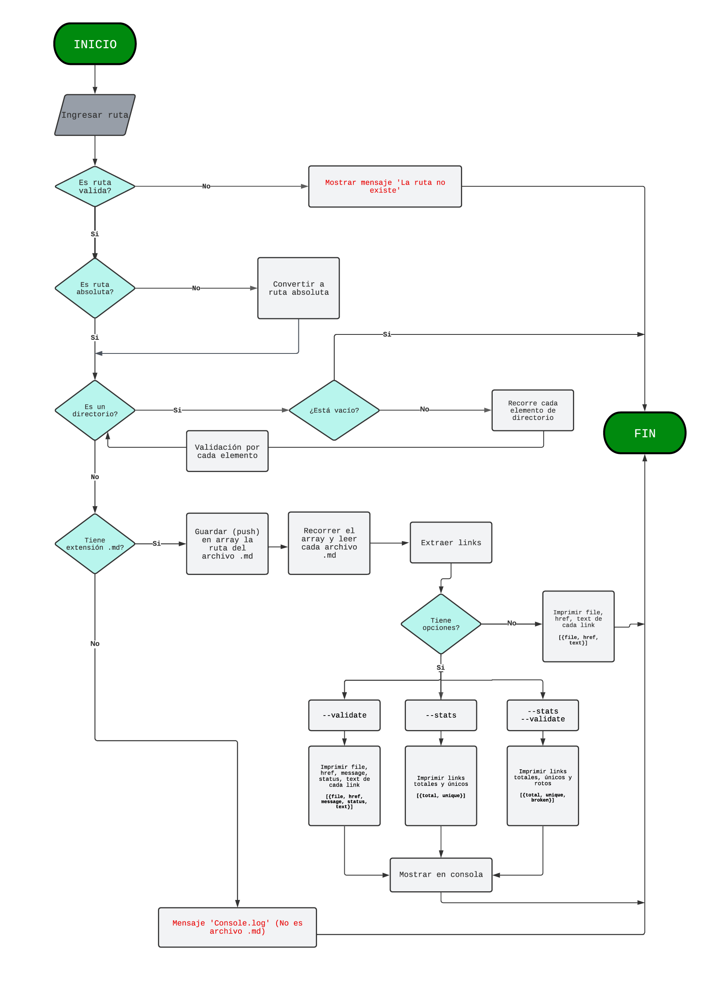
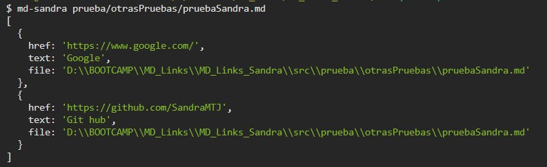
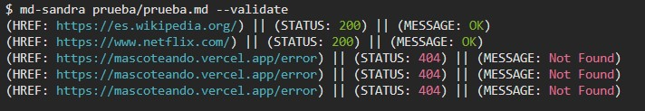
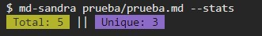
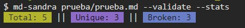

# Markdown Links

## Índice

* [1. Preámbulo](#1-preámbulo)
* [2. Resumen del proyecto](#2-resumen-del-proyecto)
* [3. Descripción del proyecto](#3-descripción-del-proyecto)
* [4. Checklist](#4-checklist)
* [5. Desplegado en NPM](#5-desplegado-en-npm)

***

## 1. Preámbulo

[Markdown](https://es.wikipedia.org/wiki/Markdown) es un lenguaje de marcado
ligero muy popular entre developers. Es usado en muchísimas plataformas que
manejan texto plano (GitHub, foros, blogs, ...), y es muy común
encontrar varios archivos en ese formato en cualquier tipo de repositorio
(empezando por el tradicional `README.md`).

Estos archivos `Markdown` normalmente contienen _links_ (vínculos/ligas) que
muchas veces están rotos o ya no son válidos y eso perjudica mucho el valor de
la información que se quiere compartir.

Dentro de una comunidad de código abierto, nos han propuesto crear una
herramienta usando [Node.js](https://nodejs.org/), que lea y analice archivos
en formato `Markdown`, para verificar los links que contengan y reportar
algunas estadísticas.

## 2. Resumen del proyecto

Este proyecto tiene la finalidad de verificar los links, que se encuentran en archivos de formato Markdown, 
reportando estadísticas si son válidos, únicos o están rotos. Utilizando Node.js el entorno de desarrollo de Javascript.

## 3. Descripción del proyecto

### Diagrama de flujo

### Planeación

[Github Projects](https://github.com/users/SandraMTJ/projects/2)

### Especificaciones técnicas

Las herramientas y dependencias implementadas para la construción de esta librería fueron las siguientes:

| Ejecución    | Descripción |
| ------       | ------ |
| Node.js      | Entorno de desarrollo de Javascript|

| Dependencia  | Descripción |
| ------       | ------ |
| colors       | Agrega estilo y color al proyecto|
| node-fetch   | Permite utilizar el método fetch en Node.js |
| eslint       | Herramienta para identificar sobre patrones encontrados en código ECMAScript / JavaScript |
| jest         | Framework de Javascript para los test unitarios |

| Módulos      | Descripción |
| ------       | ------ |
| fs           | Permite manejar los archivos del sistema |
| path         | Proporciona trabajar con rutas de archivos y directorios.|
| process      | Proporciona información y control sobre el proceso de Node.js actual |

### Instalación de la librería

La librería se instala con el siguiente comando desde el terminal:
  `npm install SandraMTJ/MD_Links_Sandra`
  
### Guía de Uso

La librería se ejecuta desde la terminal: `md-sandra <ruta archivo> [options: --validate, --stats, --validate --stats]`

Por ejemplo:

En caso de que el usuario solo introduce en la terminal 
`md-sandra <ruta archivo>`

#### Options

##### `--validate`

Si pasamos la opción `--validate`, el módulo debe hacer una petición HTTP para
averiguar si el link funciona o no. Si el link resulta en una redirección a una
URL que responde ok, entonces consideraremos el link como ok; en caso contrario se indica el tipo de error 
que pueda tener la petición.

##### `--stats`

Si pasamos la opción `--stats` el output (salida) será un texto con estadísticas
básicas sobre los links.

##### `--validate --stats`

Combinando estas dos opciones se obtienen estadísticas que se necesiten de los resultados de la validación, 
incluyendo el listado de links rotos.

## 4. Checklist

### General

* [:ballot_box_with_check:] Puede instalarse via `npm install --global <github-user>/md-links`

### `README.md`

* [:ballot_box_with_check:] Un board con el backlog para la implementación de la librería.
* [:ballot_box_with_check:] Documentación técnica de la librería.
* [:ballot_box_with_check:] Guía de uso e instalación de la librería

### API `mdLinks(path, opts)`

* [:ballot_box_with_check:] El módulo exporta una función con la interfaz (API) esperada.
* [:ballot_box_with_check:] Implementa soporte para archivo individual
* [:ballot_box_with_check:] Implementa soporte para directorios
* [:ballot_box_with_check:] Implementa `options.validate`

### CLI

* [:ballot_box_with_check:] Expone ejecutable `md-links` en el path (configurado en `package.json`)
* [:ballot_box_with_check:] Se ejecuta sin errores / output esperado
* [:ballot_box_with_check:] Implementa `--validate`
* [:ballot_box_with_check:] Implementa `--stats`

### Pruebas / tests

* [:ballot_box_with_check:] Pruebas unitarias cubren un mínimo del 70% de statements, functions,
  lines, y branches.
* [:ballot_box_with_check:] Pasa tests (y linters) (`npm test`).

## 5. Desplegado en NPM

[NPM](https://www.npmjs.com/package/md-links-sandramtj)
